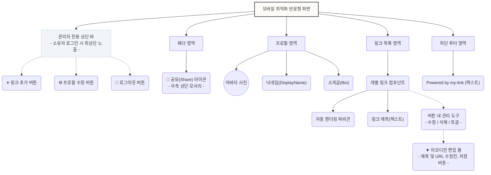

# 마이링크 (my-link) 와이어프레임 (Wireframe)

본 문서는 PRD 및 사용자 시나리오를 바탕으로 디자인된 `my-link`의 구조적 와이어프레임입니다. Mermaid 차트를 통한 컴포넌트 계층도와 직관적인 텍스트 기반 모바일 목업(Mockup)을 함께 제공합니다.

## 1. 페이지 기본 구조도 (Mermaid)

화면을 구성하는 컴포넌트의 논리적 상하 관계와 배치를 표현합니다.



---

## 2. 텍스트 기반 UI 목업 (Mockup)

### 📱 A. 방문자 화면 (Public View)
일반 사용자가 공유받은 `domain.com/닉네임` 링크를 통해 접속했을 때 보여지는 깔끔한 모바일 규격의 화면입니다. 

```text
┌───────────────────────────────────────────┐
│                                       [🚀] │ <- 우측 상단 모서리 (공유 아이콘)
│                                           │
│                 [ 아바타 ]                 │
│                                           │
│               닉네임(디스플레이명)            │
│         안녕하세요. 저의 모든 링크를 모아둔        │
│         공간입니다. 환영합니다!              │
│                                           │
│                                           │
│  ┌─────────────────────────────────────┐  │
│  │  [파비콘]  개인 포트폴리오 사이트 (웹)       │  │
│  └─────────────────────────────────────┘  │
│                                           │
│  ┌─────────────────────────────────────┐  │
│  │  [파비콘]  인스타그램 구경가기             │  │
│  └─────────────────────────────────────┘  │
│                                           │
│  ┌─────────────────────────────────────┐  │
│  │  [파비콘]  기술 블로그 (Medium)         │  │
│  └─────────────────────────────────────┘  │
│                                           │
│                                           │
│                                           │
│               Powered by my-link          │ <- 단순 텍스트 로고 푸터
└───────────────────────────────────────────┘
```

### 📱 B. 소유자 관리 화면 (Owner Inline-Edit View)
소유자가 구글 계정으로 로그인한 상태에서 진입한 뷰입니다. **화면 맨 위 관리자 바**가 노출되며, 링크 수정 시 페이지 이동 없이 바로 **아코디언 방식**으로 아래 공간이 열리며 폼이 나타납니다.

```text
┌───────────────────────────────────────────┐
│ [➕링크 추가]   [⚙️프로필 수정]     [🚪로그아웃] │ <- 화면 맨 위 고정 관리자 바
├───────────────────────────────────────────┤
│                                       [🚀] │
│                                           │
│                 [ 아바타 ]                 │
│                                           │
│               닉네임(디스플레이명)            │
│         안녕하세요. 저의 모든 링크를 모아둔        │
│         공간입니다. 환영합니다!              │
│                                           │
│                                           │
│  ┌─────────────────────────────────────┐  │
│  │  [파비콘]  개인 포트폴리오 사이트     [✏️] │  │ <- 토글: On (파란 점등)
│  └─────────────────────────────────────┘  │  
│   > ▼ 아코디언 편집 폼 (현재 활성화됨)         │  
│   │ 제목: [ 개인 포트폴리오 사이트 (웹) ]      │  
│   │ URL : [ https://myportfolio.com ]   │  
│   │                                       │
│   │                [💾저장] [취소] [🗑️삭제]   │  
│   └─────────────────────────────────────┘  │
│                                           │
│  ┌─────────────────────────────────────┐  │
│  │  [파비콘]  인스타그램 구경가기        [✏️] │  │ <- 토글: Off (회색, 비활성)
│  └─────────────────────────────────────┘  │
│                                           │
│  ┌─────────────────────────────────────┐  │
│  │  [파비콘]  기술 블로그 (Medium)      [✏️] │  │ <- 토글: On (파란 점등)
│  └─────────────────────────────────────┘  │
│                                           │
│               Powered by my-link          │
└───────────────────────────────────────────┘
```
